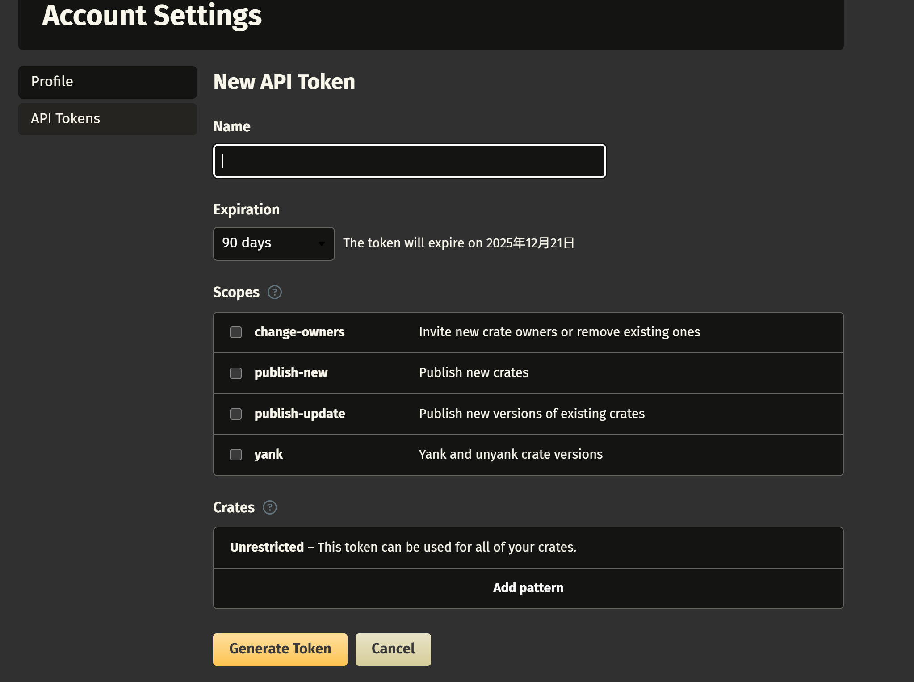

# Cargo 项目发布至 crates.io

Cargo 支持通过 Cargo.toml 配置文件来配置依赖版本并下载，还支持上传已有的 Cargo 项目到 crates.io。

下面简单介绍一下步骤：

1. 登录 `crates.io`。

    进入[crates.io 官网](https://crates.io/)，并点击右上角登录用户。

2. 配置 `crates.io` 密钥，用于用户验证。

    进入用户设置页面，点击新建 `API Token`。

    填写并保存相关信息即可。

    

3. 基于 `cargo publish` 命令实现上传。

    通过 `cargo login` 命令实现认证。

    认证成功后执行 `cargo publish` 即可实现上传。