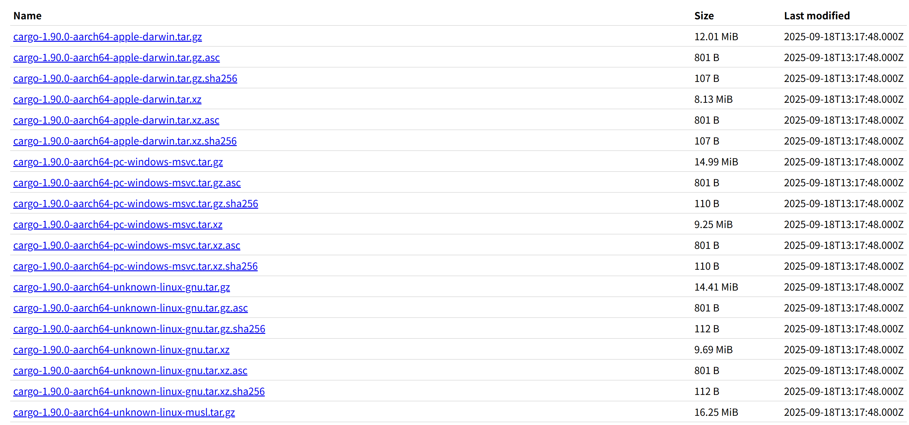

# Rust 发布包简介

参考社区版本发布说明文档：https://doc.rust-lang.org/releases.html

以当前最新版本 1.90.0 为例，该版本的 rustup 中心存储位置为：https://static.rust-lang.org/dist/2025-09-18

在使用 rustup 做 Rust 工具链版本管理的时候，开发者可以很轻松的无感知从中心仓获取对应版本、平台的工具链。

对于 Rust 工具链，Rust 官方有自己的一套定义，它有三个级别。

## Tier 1

**说明**：

Tier 1级别**保证能工作**，做了完整的自动化的测试、构建来保证功能可靠、可用。

**支持的目标**：

- aarch64-apple-darwin
- aarch64-unknown-linux-gnu
- i686-pc-windows-msvc
- i686-unknown-linux-gnu
- x86_64-pc-windows-gnu
- x86_64-pc-windows-msvc
- x86_64-unknown-linux-gnu

详细的目标平台产物信息参考：https://doc.rust-lang.org/rustc/platform-support.html#tier-1-with-host-tools

## Tier 2 

**说明**：
Tier 2 级别**只做了构建保证**，即 Rust 官方在版本发布的时候会保证构建出该级别的二进制和标准库包。
Tier 2 级别有两个子级别，从名字上可以区分，`Tier 2 with host tools` 即在构建的时候支持通过源码构建出对应平台的
`rustc` 和 `cargo` 的运行时，同时也支持一下工具的构建。`Tier 2 without host tools` 一般情况下只构建标准库，常常用于
交叉编译。

### Tier 2 with host tools

**支持的目标**：

- aarch64-pc-windows-msvc
- aarch64-unknown-linux-musl
- aarch64-unknown-linux-ohos
- arm-unknown-linux-gnueabi
- arm-unknown-linux-gnueabihf
- armv7-unknown-linux-gnueabihf
- armv7-unknown-linux-ohos
- loongarch64-unknown-linux-gnu
- loongarch64-unknown-linux-musl
- i686-pc-windows-gnu
- powerpc-unknown-linux-gnu
- powerpc64-unknown-linux-gnu
- powerpc64le-unknown-linux-gnu
- powerpc64le-unknown-linux-musl
- riscv64gc-unknown-linux-gnu
- riscv64gc-unknown-linux-musl
- s390x-unknown-linux-gnu
- x86_64-apple-darwin
- x86_64-unknown-freebsd
- x86_64-unknown-illumos
- x86_64-unknown-linux-musl
- x86_64-unknown-linux-ohos
- x86_64-unknown-netbsd
- x86_64-pc-solaris
- sparcv9-sun-solaris

详细的目标平台产物信息参考：https://doc.rust-lang.org/rustc/platform-support.html#tier-2-with-host-tools

### Tier 2 without host tools

**支持的目标**：

- aarch64-apple-ios
- aarch64-apple-ios-macabi
- aarch64-apple-ios-sim
- aarch64-linux-android
- aarch64-pc-windows-gnullvm
- aarch64-unknown-fuchsia
- aarch64-unknown-none
- aarch64-unknown-none-softfloat
- aarch64-unknown-uefi
- arm-linux-androideabi
- arm-unknown-linux-musleabi
- arm-unknown-linux-musleabihf
- arm64ec-pc-windows-msvc
- armebv7r-none-eabi
- armebv7r-none-eabihf
- armv5te-unknown-linux-gnueabi
- armv5te-unknown-linux-musleabi
- armv7-linux-androideabi
- armv7-unknown-linux-gnueabi
- armv7-unknown-linux-musleabi
- armv7-unknown-linux-musleabihf
- armv7a-none-eabi
- armv7r-none-eabi
- armv7r-none-eabihf
- i586-unknown-linux-gnu
- i586-unknown-linux-musl
- i686-linux-android
- i686-pc-windows-gnullvm
- i686-unknown-freebsd
- i686-unknown-linux-musl
- i686-unknown-uefi
- loongarch64-unknown-none
- loongarch64-unknown-none-softfloat
- nvptx64-nvidia-cuda
- riscv32i-unknown-none-elf
- riscv32im-unknown-none-elf
- riscv32imac-unknown-none-elf
- riscv32imafc-unknown-none-elf
- riscv32imc-unknown-none-elf
- riscv64gc-unknown-none-elf
- riscv64imac-unknown-none-elf
- sparc64-unknown-linux-gnu
- thumbv6m-none-eabi
- thumbv7em-none-eabi
- thumbv7em-none-eabihf
- thumbv7m-none-eabi
- thumbv7neon-linux-androideabi
- thumbv7neon-unknown-linux-gnueabihf
- thumbv8m.base-none-eabi
- thumbv8m.main-none-eabi
- thumbv8m.main-none-eabihf
- wasm32-unknown-emscripten
- wasm32-unknown-unknown
- wasm32-wasip1
- wasm32-wasip1-threads
- wasm32-wasip2
- wasm32v1-none
- x86_64-apple-ios
- x86_64-apple-ios-macabi
- x86_64-fortanix-unknown-sgx
- x86_64-linux-android
- x86_64-pc-windows-gnullvm
- x86_64-unknown-fuchsia
- x86_64-unknown-linux-gnux32
- x86_64-unknown-none
- x86_64-unknown-redox
- x86_64-unknown-uefi

详细的目标平台产物信息参考：https://doc.rust-lang.org/rustc/platform-support.html#tier-2-without-host-tools

## Tier 3

**说明**：
Tier 3 级别只做了代码级别的支持，**不保证构建与质量**。即生成目标平台的代码存在于官方代码库中，但官方社区并**不提供**该目标平台产物的自动化测试、构建流水线。
也**不保证**是否可用。

**支持的目标**：
接近 100+ 的目标平台产物，表格参考：https://doc.rust-lang.org/rustc/platform-support.html#tier-3