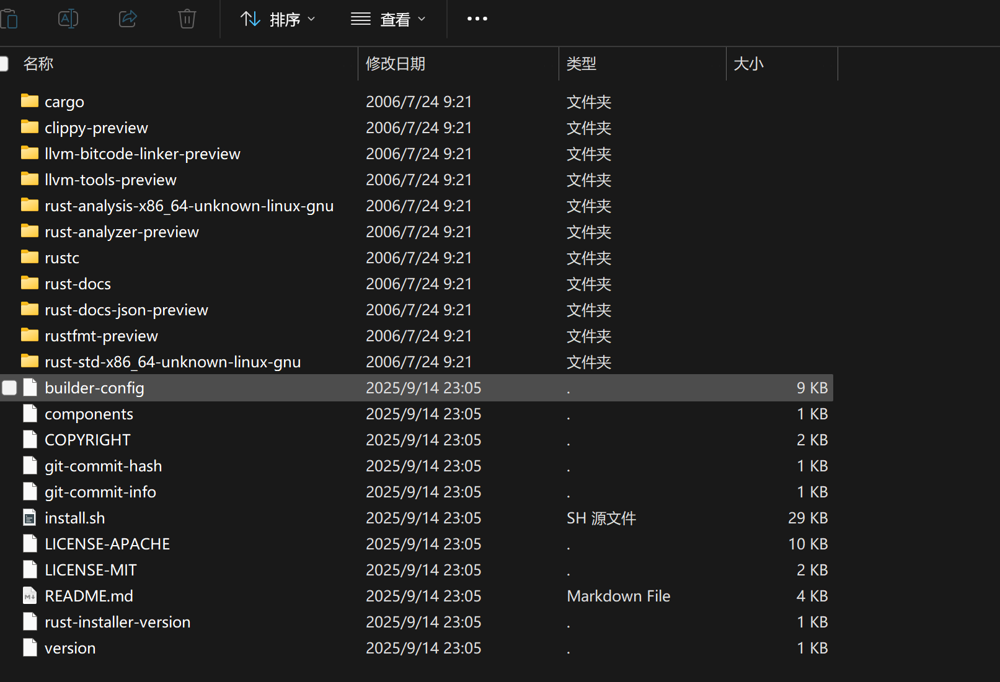

# Rust 工具链解析

Rust 发布包中包括了 Rust 开发所需要的最小集工具链。

包括但不限于：
- rustc
- cargo
- cargo-clippy
- cargo-fmt
...

下面以 1.90.0 版本的 `x86_64-unknown-linux-gnu` 这个目标平台的产物来对各个组件进行介绍。

[下载地址](https://static.rust-lang.org/dist/2025-09-18/rust-1.90.0-x86_64-unknown-linux-gnu.tar.gz)



通过 `install.sh` 进行安装

```shell
sh install.sh
```


## 组件介绍

| 组件名称            | 组件功能                                                     | 版本配套关系             |
| ------------------- | ------------------------------------------------------------ | ------------------------ |
| rustc               | 工具链的**绝对核心**。其版本号（如 1.90.0）定义了整个工具链的版本。不同版本的 `rustc` 在语言特性、语法、编译错误信息和内部 API 上均有差异，直接决定代码能否编译。 | 与版本强相关             |
| rust-std            | 由相同版本的**`rustc`**编译生成。包含了版本所有稳定的 API，数据类型和内在函数（intrinsics）。任何版本不匹配都会导致链接错误或未定义行为，因为编译器期望的标准库元数据与实际链接的库不兼容。 | 与版本强相关             |
| rust-docs           | 文档工具。文档内容精确对应版本的语言特性和标准库 API。使用错误版本的文档会导致查阅的 API 说明或语言示例与实际编译器的行为不符。 | 与版本强相关             |
| rust-docs-json      | （待补充）                                                   | 与版本强相关             |
| cargo               | 与 `rustc` 协同工作，调用特定版本的编译器。其功能（如特性标志、构建脚本接口、依赖解析规则）与 `rustc` 版本紧密绑定与发展，必须匹配以确保构建过程的正确性。 | 与版本强相关             |
| rustfmt             | 其格式化规则和风格与特定版本的语言语法和惯用法保持一致。规则会随版本更新而引进，不同版本可能会对同一段代码格式化出不同结构。 | 与版本强相关             |
| rust-analyzer       | （待补充）                                                   | 与版本强相关（特定版本） |
| llvm-tools          | 包含与版本 `rustc` 所使用的 LLVM 后端完全匹配的工具（如 `llvm-objdump`，`llvm-size`）。LLVM 版本不同会导致生成或分析的二进制格式不兼容。 | 与版本强相关             |
| clippy              | 作为 `rustc` 的编译器插件运行，深度依赖 `rustc` 的内部接口（AST、HIR、类型系统等）。这些接口在不同版本间不稳定，因此 `clippy` 必须与 `rustc` 版本严格匹配。 | 与版本强相关             |
| rust-analysis       | （待补充）                                                   | 与版本强相关             |
| llvm-bitcode-linker | （待补充）                                                   | 与版本强相关             |
