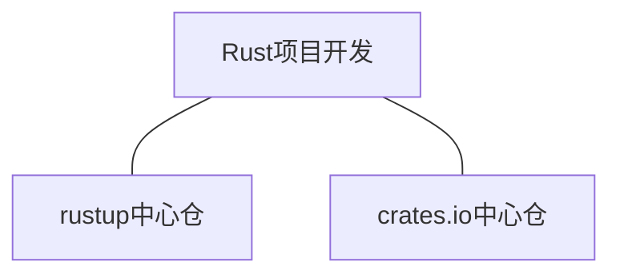

# 中心仓基本概念

## 简介

首先，对于绝大多数 Rust 开发者而言，在开发 Rust 项目的过程中，有两个绕不开的基础设施服务：`rustup 中心仓` 与 `crates.io 中心仓`：

## 一、Rustup 中心仓

### 什么是 Rustup 中心仓

rustup 中心仓简单来说就是由 Rust 官方社区维护的，用于存放

### 如何使用 Rustup 中心仓

## 二、Crates.io 中心仓

### 什么是 Crates.io 中心仓

### 如何使用 Crates.io 中心仓

